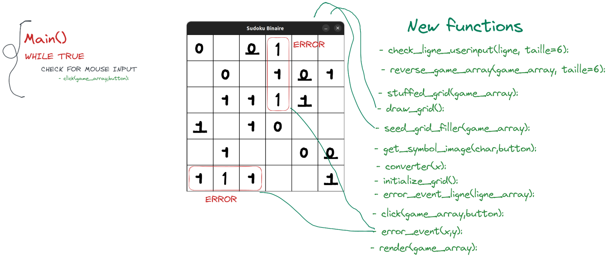

# Binary Sudoku

## V1
### Description: 
This is a game called Binary Sudoku, which is a variation of the classic game Sudoku. The goal of the game is to fill a grid with the symbols "X" and "O" such that each row and column contains an equal number of "X" and "O" symbols, and no more than two "X" or "O" symbols are next to each other in a row or column. The code includes functions to generate a grid, display the grid, check if a seed (initial configuration of the grid) is valid, and generate a semi-random seed. It also includes functions to check if a given grid has any duplicate rows or columns.
### Functions:

- generateur_grille(taille=6):
	generates an empty grid

- affichage(grille=generateur_grille(6)):
	displays a grid in a clean and user-friendly way

- check_seed(grille, taille=6):
	optimized function to check a seed
	- line check side by side on grid
	- line check side by side on inverted grid
	- duplicate line check on inverted grid
	- duplicate lines check on inverted grid

- check_grille_doublons(grille, taille=6):
	checks if there are duplicate rows or columns

- check_ligne_cc(ligne, taille=6):
	check boxes side by side on a line

- reverse_grille(grille, taille=6):
	converts columns to rows and rows to columns in a matrix

- seed_generator_semirandom(taille=6):
	this function tries to manage the generation but with 2 rules already taken into account

- forbid_giver(grille, taille):
	returns the indices already present in the given grid

- collectioner(taille=6):
	function that generates an infinite number of grids I found a valid one

- shaker(grille):
	this function will shuffle the grid, to make it playable

- check_ligne_doublons(ligne, taille):
	check if there are no duplicates on the line

- grille_unpacker(grille, taille):
	unpack the grid, will therefore return all the elements of the matrix as a list

## V2
### Description:
Introducing Binary Sudoku, the updated version of the classic game Sudoku with a new feature - a GUI interface. In this version, the symbols "X" and "O" have been replaced with "1" and "0" respectively. The goal of the game is still to fill a grid with the symbols "1" and "0" such that each row and column contains an equal number of "1" and "0" symbols, and no more than two "1" or "0" symbols are next to each other in a row or column.
The updated code includes functions to generate a grid, display the grid using the new GUI interface, check if a seed (initial configuration of the grid) is valid, and generate a semi-random seed. It also includes functions to check if a given grid has any duplicate rows or columns. With the new GUI interface, users can easily and quickly input "1" and "0" symbols into the grid and see exactly where their mistakes are.
In addition, I’ve completely recoded the backend of the game using the numpy library, making the code run faster and more efficiently
Required packages:
- pygame 2.1.2
- numpy 
### Functions:
The same functions of V1 for the backend but with the numpy library.
The new functions:
- check_ligne_userinput(ligne, taille=6):
	check the boxes side by side

- reverse_game_array(game_array, taille=6):
	converts columns to rows in a matrix

- stuffed_grid(game_array):
	check if the grid is full

- draw_grid():
	displays the grid (not to be confused with the render function)
    
- converter(x):
	allows to convert the image according to the element present in the box

- initialize_grid():
	initialize the grid typically at the start of the game

- seed_grid_filler(game_array):
	fills in the starting grid with ones and zeros
   	 
- get_symbol_image(char,button):
	allows you to obtain the image according to the button pressed, left click for the 1 right click for the 0
	and other checks depending on the input already present

- error_event(x,y):
	show the error depending on the input

- error_event_ligne(ligne_array):
	show the error on the whole row, typically a case of duplicate rows (or columns)

- click(game_array,button):
	This function is a click event handler for a game. The function receives a game_array that represents the state of the game and a button that represents the player's input (either 'X' or 'O').
The function first gets the mouse position using Pygame's get_pos() function. It then iterates over the game_array and checks whether the mouse position is within the bounds of any of the squares on the game grid. If it is, the function tries to update the square with the player's input.
Before updating the square, the function performs several checks to ensure that the update is valid. These checks include:
Making sure that the square is not already occupied by checking if the square is in the forbid list.
Making sure that the update does not cause there to be three consecutive X's or O's in a row or column by calling the check_ligne_userinput() function.
Making sure that the update does not cause there to be more than two X's or O's in a row or column by calling the check_ligne_doublons() function.
Making sure that the update does not cause there to be duplicated rows or columns by calling the check_dbl() function.
If any of these checks fail, the function calls the error_event() function to indicate that the update is invalid. If all of the checks pass, the function updates the square in the game_array and seed variables with the player's input and displays the updated grid.
           	 
- render(game_array):
show the game and render the grid according to game_array

